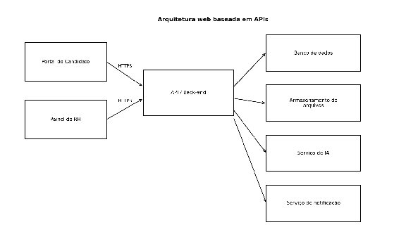

# Arquitetura

A arquitetura separa interface do usuário, API de negócio, banco de dados, armazenamento de arquivos, serviço de IA e serviço de notificações — para facilitar manutenção, testes, controle de acesso e evolução.

- **Front-end**: telas do candidato e do RH.
- **API/back-end**: regras de negócio, autenticação, validação de dados, controle de permissões, integração com banco e serviços externos.
- **Banco de dados**: dados estruturados (ver [modelo-de-dados.md](modelo-de-dados.md)).
- **Armazenamento de arquivos**: currículos e documentos, em serviço próprio ou nuvem.

## Módulos do sistema

- **Autenticação**: login, perfis e permissões.
- **Candidato**: cadastro de currículo, visualização de vagas, candidatura, acompanhamento de status, envio de documentos.
- **RH**: cadastro de vagas, consulta de candidatos, atualização de etapas, solicitações de documentos.
- **IA**: compara dados de currículo com requisitos da vaga e retorna análise resumida.
- **Administrativo**: usuários internos, permissões e parâmetros gerais.

## Integração com IA

O acesso aos modelos de linguagem é feito via API da OpenRouter (agrega modelos de diferentes fornecedores sob uma única interface, reduzindo o acoplamento a um provedor específico). O back-end envia ao endpoint da OpenRouter um prompt estruturado com os dados do currículo e os requisitos da vaga, recebendo como resposta a recomendação de aderência exibida ao RH. A escolha do modelo específico considera custo por requisição, tempo médio de resposta (RNF06 — até 8s) e qualidade de interpretação de currículos em português.

## Fluxo operacional do processo seletivo

1. RH cadastra uma vaga.
2. Candidato visualiza a vaga e envia candidatura → status `inscrito`.
3. RH consulta inscritos e pode solicitar triagem assistida por IA.
4. IA retorna pontuação/resumo de aderência, revisado por uma pessoa do RH.
5. RH atualiza o status conforme a análise avança (em análise, entrevista, aprovado, reprovado).
6. Se aprovado, candidato recebe solicitação de envio de documentos, encerrando o fluxo inicial de contratação.

## Critérios para triagem assistida por IA

- Considerar apenas informações relacionadas à vaga: experiências, formação, competências técnicas, localização quando relevante, disponibilidade e requisitos informados pelo RH.
- Evitar dados sensíveis ou irrelevantes para ranqueamento.
- Apresentar o resultado como recomendação/resumo de aderência — nunca como decisão automática (ver RN04).
- RH deve conseguir visualizar quais requisitos foram considerados, revisar o currículo completo e alterar manualmente o andamento da candidatura.
- Registrar a data da análise e manter histórico das decisões humanas posteriores.
