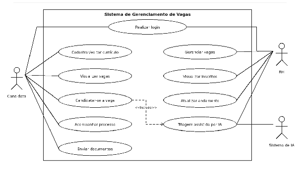
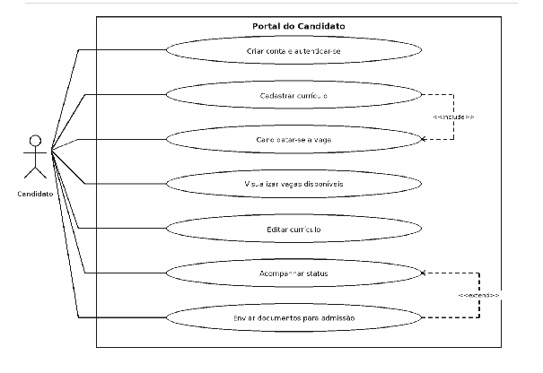
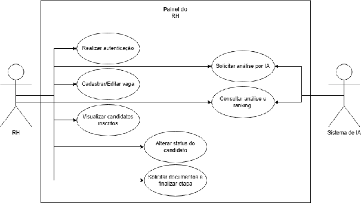

# Casos de Uso

## Especificação resumida

| Código | Caso de uso | Ator principal | Descrição |
| ----- | ----- | ----- | ----- |
| UC01 | Realizar login | Candidato, RH e administrador | Autenticar usuário e direcionar para o ambiente correto conforme perfil. |
| UC02 | Cadastrar currículo | Candidato | Registrar dados pessoais, formação, experiências e competências. |
| UC03 | Visualizar vagas | Candidato | Consultar oportunidades abertas e detalhes da vaga. |
| UC04 | Candidatar-se a vaga | Candidato | Registrar candidatura de um candidato em uma vaga disponível. |
| UC05 | Acompanhar status | Candidato | Consultar o andamento das candidaturas em cada vaga. |
| UC06 | Enviar documentos | Candidato | Enviar arquivos após aprovação ou solicitação do RH. |
| UC07 | Gerenciar vagas | RH | Cadastrar, editar e encerrar vagas do processo seletivo. |
| UC08 | Visualizar candidatos inscritos | RH | Consultar candidatos vinculados a uma vaga e acessar currículo. |
| UC09 | Atualizar andamento | RH | Alterar status do candidato conforme a etapa do processo. |
| UC10 | Solicitar triagem por IA | RH | Acionar análise automatizada de aderência entre currículo e vaga. |
| UC11 | Consultar análise da IA | RH | Visualizar resultado da triagem como apoio à decisão. |
| UC12 | Gerenciar permissões | Administrador | Criar perfis internos e ajustar permissões de acesso. |

## Refinamento dos principais casos de uso

| Caso de uso | Pré-condição | Fluxo principal | Fluxo alternativo/exceção | Pós-condição |
| ----- | ----- | ----- | ----- | ----- |
| UC01 - Realizar login | Usuário cadastrado e ativo. | Informar e-mail e senha; validar credenciais; identificar perfil; direcionar para Portal do Candidato, Painel do RH ou área administrativa. | Credenciais inválidas geram mensagem de erro. Usuário bloqueado não acessa o sistema. | Sessão iniciada conforme perfil. |
| UC04 - Candidatar-se a vaga | Candidato autenticado, currículo cadastrado e vaga aberta. | Visualizar detalhes da vaga; confirmar candidatura; sistema verifica duplicidade; registrar candidatura com status inscrito. | Se a vaga estiver encerrada ou já houver candidatura, o sistema impede novo cadastro. | Candidatura vinculada ao candidato e à vaga. |
| UC07 - Gerenciar vagas | Profissional de RH autenticado. | Cadastrar ou editar título, descrição, requisitos, local, modalidade, prazo e status; salvar alterações; disponibilizar vaga conforme status. | Campos obrigatórios não preenchidos impedem publicação. Vaga encerrada mantém histórico. | Vaga criada, atualizada ou encerrada. |
| UC08 - Visualizar candidatos inscritos | RH autenticado e vaga cadastrada. | Selecionar vaga; listar candidatos; acessar currículo, histórico, documentos e análise de IA quando existir. | Caso não existam inscritos, o sistema exibe lista vazia com aviso. | Candidatos apresentados para análise. |
| UC09 - Atualizar andamento | Candidatura existente e RH com permissão. | Selecionar candidato; escolher novo status; registrar observação; salvar alteração; registrar histórico e notificar candidato. | Status inválido ou ausência de permissão impede alteração. | Status atualizado e histórico mantido. |
| UC10 - Solicitar triagem por IA | Candidatura com currículo e vaga com requisitos definidos. | RH aciona triagem; API envia dados necessários ao serviço de IA; resultado retorna com pontuação e resumo; sistema grava análise. | Falha no serviço de IA deve exibir aviso e permitir nova tentativa posterior. | Análise disponível como apoio à decisão humana. |
| UC06 - Enviar documentos | Candidato aprovado ou com solicitação ativa. | Selecionar arquivo; validar formato e tamanho; armazenar documento; vincular à candidatura; informar recebimento. | Arquivos fora do padrão PDF/DOCX ou acima de 5 MB são recusados. | Documento recebido e disponível ao RH. |

## Diagramas de caso de uso

Diagrama geral:

Portal do Candidato:

Painel do RH:

