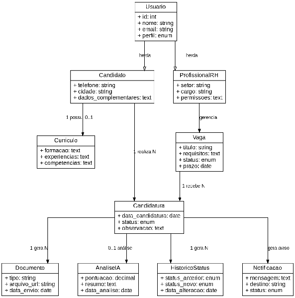

# Diagrama de Classes

Principais entidades lógicas do sistema e seus relacionamentos (usuários, candidatos, vagas, currículos, candidaturas, documentos, análises de IA, histórico de status e notificações). É uma visão de análise do domínio, não representa todos os detalhes de implementação.

