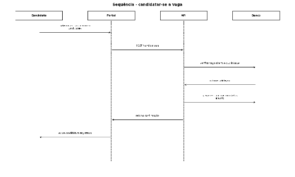
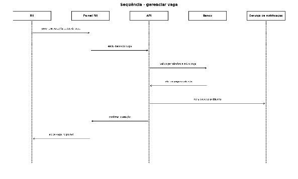
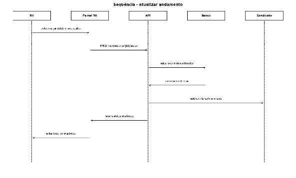
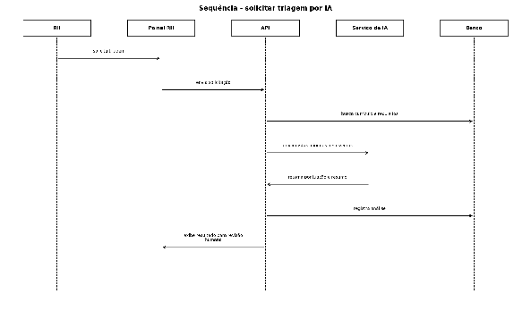
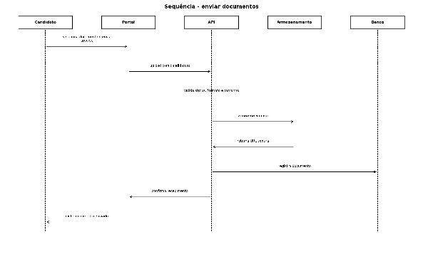

# Diagramas de Sequência

Troca de mensagens entre ator, interface, API, banco de dados e serviços externos durante os principais casos de uso.

## Candidatar-se a vaga (UC04)

## Gerenciar vaga (UC07)

## Atualizar andamento da candidatura (UC09)

## Solicitar triagem por IA (UC10)

## Enviar documentos (UC06)

