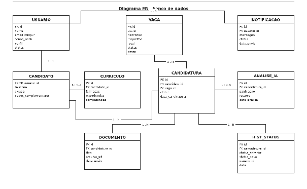

# Modelo de Dados

O schema real e atualizado do banco (tipos, enums, chaves, índices) está em [database/schema.sql](../database/schema.sql) — use-o como fonte de verdade para implementação. As tabelas abaixo são o modelo conceitual.

## Entidades principais

| Entidade | Campos principais | Finalidade |
| ----- | ----- | ----- |
| Usuário | id, nome, e-mail, senha_hash, perfil, status | Representa candidatos, profissionais de RH e administradores. |
| Candidato | usuario_id, telefone, cidade, dados complementares | Armazena informações específicas do candidato. |
| Currículo | id, candidato_id, formação, experiências, competências, resumo | Concentra informações profissionais usadas nas candidaturas. |
| Vaga | id, título, descrição, requisitos, local, modalidade, tipo, status | Representa uma oportunidade cadastrada pelo RH. |
| Candidatura | id, candidato_id, vaga_id, status, data_candidatura | Relaciona candidato e vaga, registrando o andamento do processo. |
| Documento | id, candidatura_id, tipo, arquivo_url, data_envio | Registra documentos enviados pelo candidato. |
| Análise IA | id, candidatura_id, pontuação, resumo, data_análise | Armazena o resultado da triagem assistida por IA. |
| Histórico de status | id, candidatura_id, status_anterior, status_novo, usuário, data | Mantém rastreabilidade das mudanças do processo. |

## Diagrama ER

