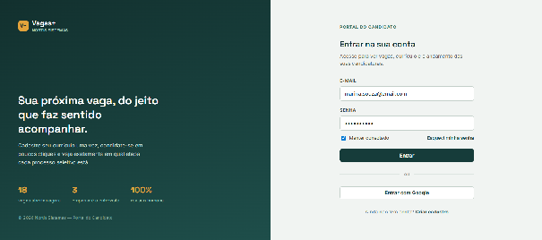
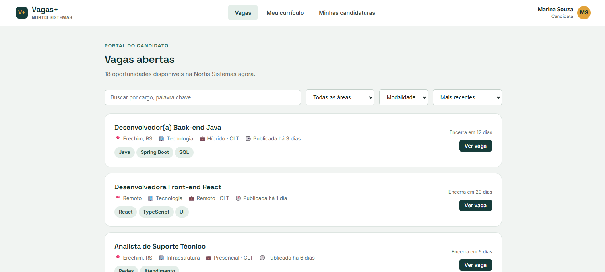
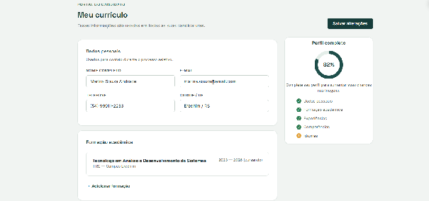
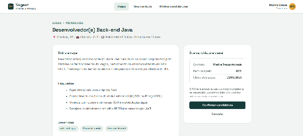
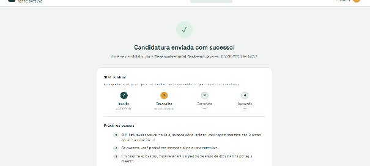
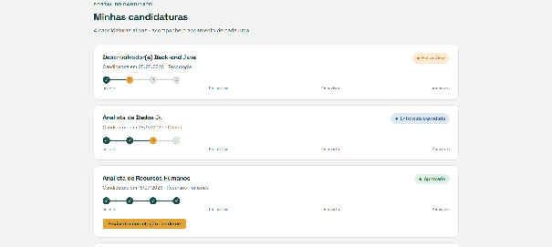
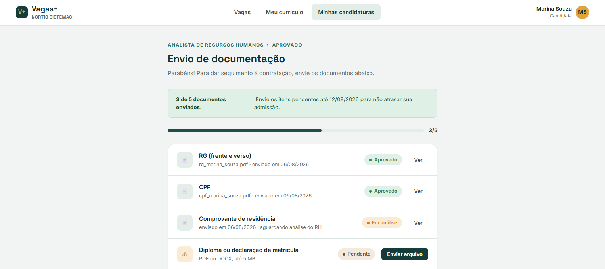
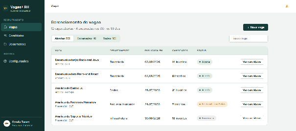
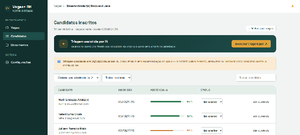
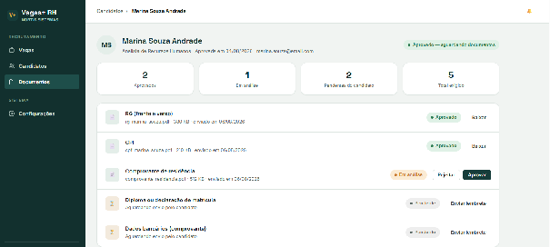

# Protótipos das Principais Telas

Protótipos de baixa fidelidade: definem organização dos elementos e fluxo de navegação, não a identidade visual final.

| Tela | Usuário principal | Finalidade |
| ----- | ----- | ----- |
| Login e cadastro | Candidato, RH e administrador | Permitir acesso seguro ao sistema e criação de conta do candidato. |
| Lista de vagas | Candidato | Exibir oportunidades abertas, filtros de busca e acesso aos detalhes da vaga. |
| Currículo e candidatura | Candidato | Permitir cadastro/edição do currículo e confirmação da candidatura. |
| Acompanhamento e documentos | Candidato | Exibir status da candidatura e permitir envio de documentos solicitados. |
| Painel de vagas | RH | Permitir criação, edição, encerramento e acompanhamento das vagas cadastradas. |
| Candidatos e triagem | RH | Listar inscritos, apresentar aderência da IA e permitir atualização do andamento. |

## Portal do Candidato

## Painel do RH

